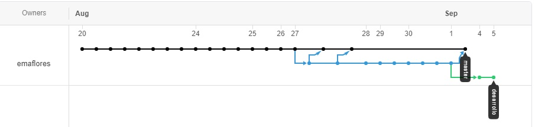

# CLIP-2020

Repositorio para practicas en Clip 2020
--
Ver en vivo los resultados: [Click Aqui](http://emaflores.me/clip-2020/)

Tareas
--
* Diseña un sitio web (contenido a elección) de 2 o 3 páginas web que incluya:
* Etiquetas semánticas (html5).
* Enlaces externos e internos.
* Al menos una imágen (html5).
* Al menos una tabla.
* Estilos externos e internos (CSS3).
* Agregar Boostrap:
    - Una barra de navegacion que permita movernos por las paginas web del sitio
    - Un formulario de contacto (datos obligatorios: Apellido, Nombre, Email y Mensaje) 
      verificando Email en el formato correcto
* Agregar JavaScript: Agregar una adivinanza tal que
    - contenga un cuadro de texto y un boton
    - facilitar al usuario 2 pistas si el usuario no acierta en los intentos 2 y 3
    - informar en todo momento al usuario el numero de intentos que le quedan
    - informar el resultado final (si acierta o si perdio los 4 intentos)
    - (opcional) usar los Alerts de Bootstrap 4 para informar al usuario

Como Trabaje:
--
Inicie el repositorio vacio en GitHub, y desde ahi lo clone. Empece realizando actividades en la rama principal o Master. Al poco tiempo comence a trabajar en una rama alternativa
para probar ideas y luego fusionarlas. Esto lo realice en la rama desarrollo:

Se hizo uso de la mayoria de herramientas presentadas, tanto con [HTML5](https://es.wikipedia.org/wiki/HTML5), [CSS3](https://es.wikipedia.org/wiki/Hoja_de_estilos_en_cascada#CSS3), [JavaScript](https://es.wikipedia.org/wiki/JavaScript) y [Bootstrap 4](https://es.wikipedia.org/wiki/Bootstrap_(framework))

Todo de la mano de los excelentes mentores:
--
- **Lorena Alejandra FACCENDINI** - [Email](mailto:lfaccendini@gmail.com) - [Linkedin](https://www.linkedin.com/in/lorena-faccendini/)

- **Narciso Héctor PEREZ** - [Email](mailto:narcisoperez@gmail.com) - [Linkedin](https://www.linkedin.com/in/narciso-perez-b9177b18/)

*Hecho con &hearts; por Emanuel Flores &copy; - 2020*
